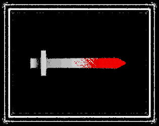

# ROUND TABLE

## Available Commands

| Command | Description |
|---------|-------------|
| `npm install` | Install project dependencies |
| `npm start` | Build project and open web server running project |
| `npm run build` | Builds code bundle with production settings (minification, uglification, etc..) |

## Release

1. Bump the package version (`npm version patch/minor/major`)
2. Push changes
3. Go to [release action](https://github.com/SweetheartSquad/AGBIC2019---Round-Table/actions/workflows/release.yml)
4. Select "Run workflow", and confirm on `main` branch

The workflow will automatically create a build and upload it to itch.io.

---

Based on [Phaser 3 boilerplate project](https://github.com/photonstorm/phaser3-project-template)
